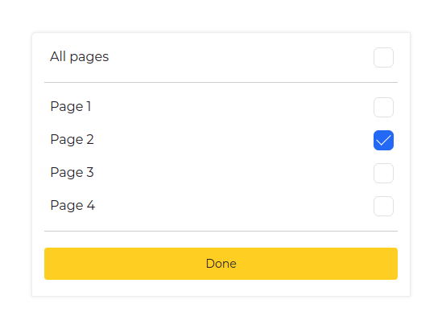

## Description
The goal of this assignment is to replicate a specified component using HTML, CSS, and JavaScript (if necessary). Your task involves accurately recreating a component based on the provided design from Figma, ensuring it mirrors the original design's aesthetics and functionality as closely as possible. It is crucial that the result is as pixel-perfect as possible. Additionally, make sure to launch the prototype in Figma to see all the component details.

## Requirements

1. Access to the Design: [[Link to the Figma design](https://www.figma.com/design/dwBFtlKY933OJWWSrGPs5q/Frontend?node-id=0-1)].
2. Technologies: HTML, CSS, JavaScript (if needed). The use of frameworks
   such as React, Vue, Angular is allowed, depending on the candidate's preferences.
3. Interactivity: If there are interactive elements (e.g., buttons, links, input forms) within the component, they should be functional.
4. Code: The code should be clean, well-organized, and easy to read.



## Running the app

```bash
# 
$ npm install
$ npm run dev
```
Have a look on http://localhost:5173


# React + Vite

This template provides a minimal setup to get React working in Vite with HMR and some ESLint rules.

Currently, two official plugins are available:

- [@vitejs/plugin-react](https://github.com/vitejs/vite-plugin-react/blob/main/packages/plugin-react/README.md) uses [Babel](https://babeljs.io/) for Fast Refresh
- [@vitejs/plugin-react-swc](https://github.com/vitejs/vite-plugin-react-swc) uses [SWC](https://swc.rs/) for Fast Refresh
